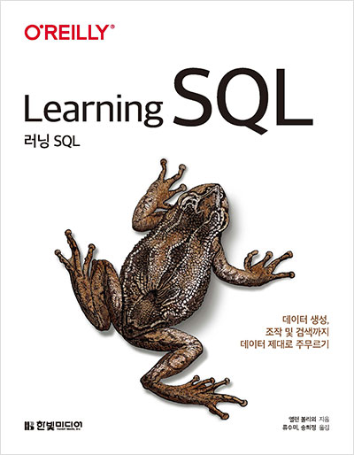

# Learing SQL 

> [Learing SQL](https://m.hanbit.co.kr/store/books/book_view.html?p_code=B4640245615)책을 읽고 외적으로 학습한 내용을 정리 합니다.

<br/>

# 🐈 시작 가이드

예제를 실행하기 위해 필요합니다.

터미널에서 mysql 접속 후 SOURCE 명령어를 통해 예제 스키마 > 예제 데이터 순으로 SQL 파일 실행 해야됩니다.

- Mysql 8.0 버전 이상 사용

```sql
mysql -u <user> -p
SOURCE /<폴더위치>/sakila-db/sakila-schema.sql
SOURCE /<폴더위치>/sakila-db/sakila-data.sql
```

<br/>

# 📚 구조 설명

```bash
📂 src # 소스 및 코드 설명
📂 source # 예제 SQL 정답 소스
📂 sakila-db # 예제 SQL 소스
```

<br/>

# 🌿 추가적으로 학습한 내용

### 1장

- [31p - 정규화](./src/1장/31p-정규화.md)

### 4장

- [117p - 서브쿼리를 활용한 필터링](./src/4장/117p-서브쿼리를%20활용한%20필터링.md)

<br/>

# 📝 참고

- [원본 sakila database](https://dev.mysql.com/doc/index-other.html)
